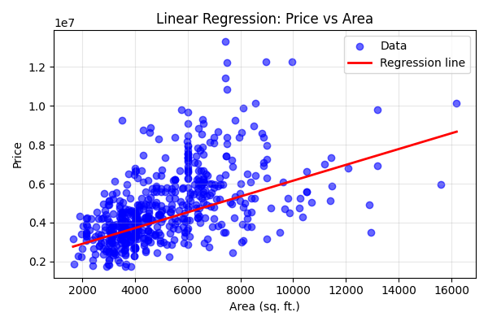
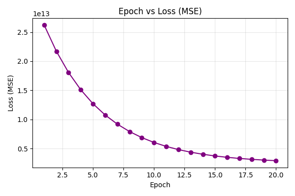
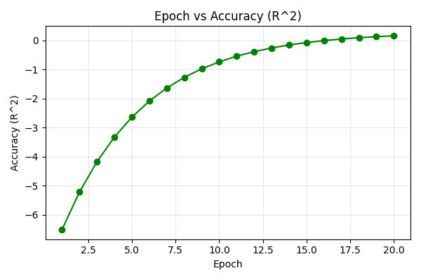

# House Price by Size Predictor

A beginner-friendly implementation of linear regression using batch gradient descent to predict house price from area.

This project uses the `Housing.csv` dataset and trains a simple model on a single feature (`area`) to predict `price`. The script logs per-epoch metrics and saves plots for learning progress and the regression line.

## Files
- `train.py` — trains the model with batch gradient descent and generates plots.
- `Housing.csv` — input dataset (must contain `area` and `price`).
- `app.py` — optional Streamlit app (not used in this assignment).
- `requirements.txt` — Python dependencies.

## How to run
From the project root directory:

```bash
python -u train.py
```

What you’ll see:
- Per-epoch metrics: MSE (loss) and R² (accuracy proxy for regression).
- Learned parameters in both standardized and original feature scales.
- Saved figures in the project directory.

## Hyperparameters
Edit near the top of `train.py`:
- `EPOCHS` — number of training epochs (e.g., 20, 100, 500)
- `LEARNING_RATE` — step size for gradient updates (e.g., 0.01–0.05)

## Generated Plots
`train.py` saves the following figures automatically:
- `epoch_vs_accuracy.png` — Epoch vs Accuracy (R²)
- `epoch_vs_loss.png` — Epoch vs Loss (MSE)
- `price_vs_area_regression.png` — Scatter of area vs price with regression line

## Figures (Provided)
Below are the three figures included in this repository:







## Notes
- Using only `area` limits achievable R². Including more features (e.g., rooms, stories) can improve performance.
- Large price magnitudes can make optimization slower; standardizing features (done here) and optionally normalizing the target can help stability.
